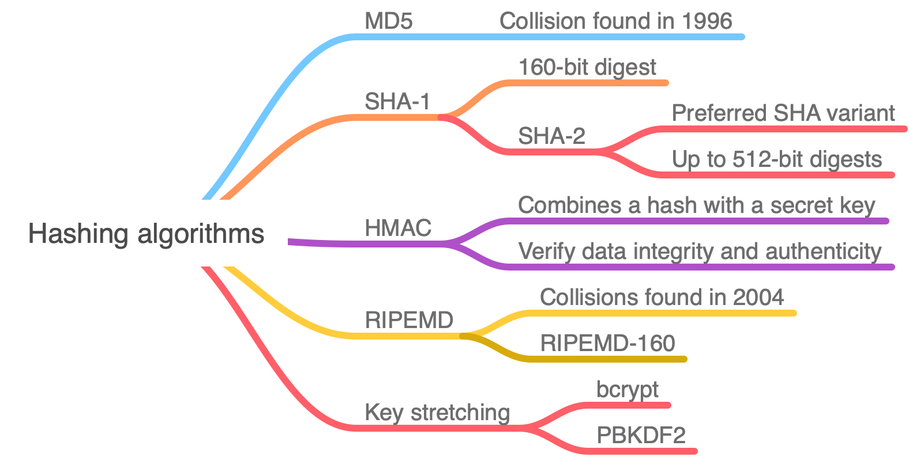
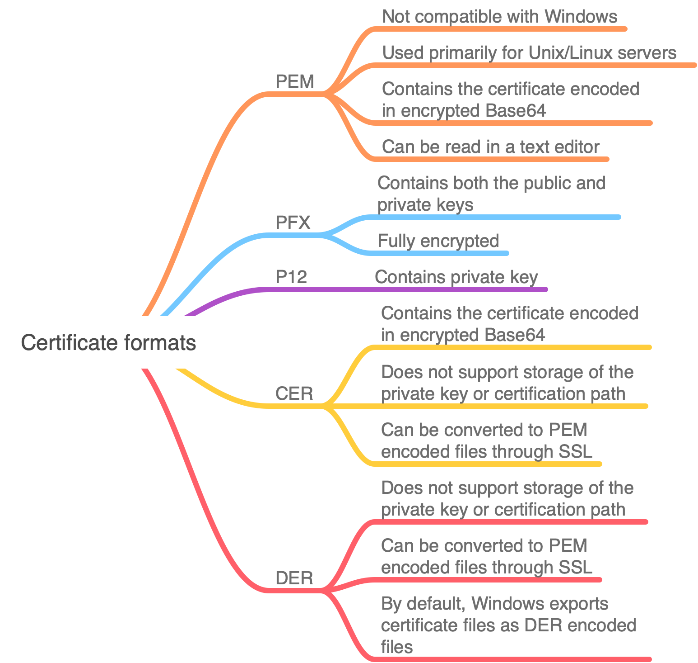
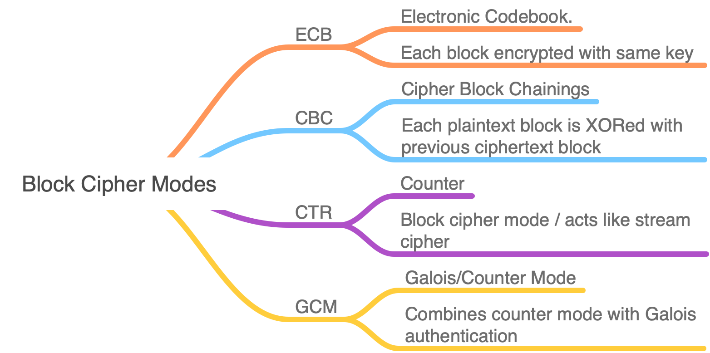

# CompTIA Security+ SY0-501 Study Resources

## Exam Objectives ([PDF](https://www.comptia.jp/pdf/Security%2B%20SY0-501%20Exam%20Objectives.pdf))

The following notes correlate exam objectives with video resources from James Messer, Jason Dion, and Mike Meyers.

### [1.0 Threats, Attacks and Vulnerabilities](1.md)

### [2.0 Technologies and Tools](2.md)

### [3.0 Architecture and Design](3.md)

### [4.0 Identity and Access Management](4.md)

### [5.0 Risk Management](5.md)

### [6.0 Cryptography and PKI](6.md)

### [Ports](ports.md)

## Quizlets

- mikeh
  - [1.0 Threats, Attacks and Vulnerabilities](https://quizlet.com/276949579/comptia-security-sy0-501-threats-attacks-and-vulnerabilities-flash-cards/)
  - [2.0 Technologies and Tools](https://quizlet.com/277796572/comptia-security-sy0-501-technologies-and-tools-flash-cards/)
  - [3.0 Architecture and Design](https://quizlet.com/279488695/comptia-security-sy0-501-architecture-and-design-flash-cards/)
  - [4.0 Identity and Access Management](https://quizlet.com/280256173/comptia-security-sy0-501-identity-and-access-management-flash-cards/)
  - [5.0 Risk Management](https://quizlet.com/281131119/comptia-security-sy0-501-risk-management-flash-cards/)
  - [6.0 Cryptography and PKI](https://quizlet.com/281819130/comptia-security-sy0-501-cryptography-and-pki-flash-cards/)
  - [Acronyms](https://quizlet.com/282666495/comptia-security-sy0-501-acronyms-flash-cards/)
  - [Ports and Protocols](https://quizlet.com/295219086/comptia-security-sy0-501-ports-and-protocols-flash-cards/)

## Practice Tests

- [passcomptia.com](https://passcomptia.com/comptia-security/)
- [examcompass.com](https://www.examcompass.com/comptia/security-plus-certification/free-security-plus-practice-tests)
- [Security+ Practice Tests, by Mike Chapple](https://www.amazon.com/Security-Practice-Tests-Prepare-CertMike-ebook/dp/B07N6PD4ML/) (Kindle), by Mike Chapple
- [CompTIA Security+ Practice Tests SY0-501](https://www.amazon.com/CompTIA-Security-Practice-Tests-SY0-501-ebook/dp/B082SZRX4R/) (Kindle), by Ian Neil
- [CompTIA Security+ (SY0-501) Practice Exams with Simulations](https://www.udemy.com/course/comptia-security-practice-exams/)

## Videos

- [CompTIA Security+ SY0-501 Training Course](https://www.youtube.com/watch?v=hZ2voph67v8&list=PL5ysgoFoCpZEM8cboeHdRDePc2bOU9CN1&index=95) (James Messer)
- [CompTIA Security+ Full Course](https://www.youtube.com/watch?v=O4pJeXgOJDs) (My CS)

## Books

- [_CompTIA Security+ All-in-One Exam Guide, Fifth Edition_](https://www.amazon.com/CompTIA-Security-Guide-Fifth-SY0-501-ebook-dp-B07893H98L/dp/B07893H98L/ref=mt_other?_encoding=UTF8&me=&qid=1594008009), by Conklin, White, Cothren, David, and Williams

## Charts

